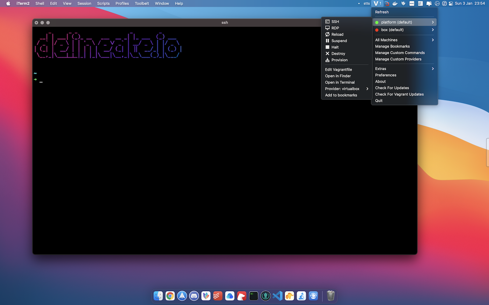
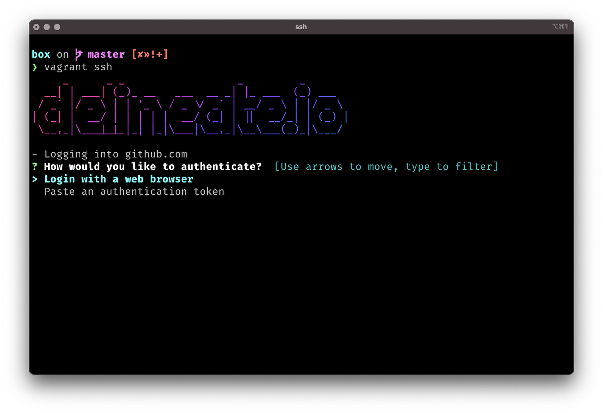

<p align="center">
  
  <h2 align="center">delineate.io</h2>
  <p align="center">portray or describe (something) precisely.</p>
</p>

# Box

[](https://opensource.org/licenses/MIT)
[](https://github.com/delineateio/box/issues?q=is%3Aissue+is%3Aopen+label%3A%22good+first+issue%22+)

## Purpose

The purpose of **box** is to provide a general purpose development `vagrant` box with a pre-installed set of useful tools.  Over time the installed tools is expected to be expanded.

### Opinionated Initialisation

The `box` is deliberately opinionated.  When an `ssh` session is established ...

* The log in process to `github` is initiated using `gh` if required and the credential helper associated with `git`
* A `gpg` key is created and configured as the signing key for `git` so commits can be verified
* If a `gcp` service account is mounted at `$HOME/.gcloud.json` then `gcloud` is automatically authenticated and configured
* If a GKE cluster name is provided then `kubectl` is automatically authenticated and configured
* An empty project is created if it does not exist pre-configured with `pre-commit` and `detect-secrets`

> More detail is provided below on how this initialisation can be configured by projects

## Approach

The solution uses [Hashicorp Vagrant](https://www.vagrantup.com/) and [Redhat Ansible](https://www.ansible.com/) to provision and configure a development [Ubuntu 18.04](https://releases.ubuntu.com/18.04/) machine based on the [Chef Bento Project](https://github.com/chef/bento).

## Mandatory Requirements

The following commands will install the mandatory requirements on MacOS using `brew`...

```shell
# Installs Ansible, VirtualBox & Vagrant
brew install ansible
brew install --cask virtualbox vagrant
```

> For additional information including alternative installation methods please review the official documentation

* [Redhat Ansible](https://docs.ansible.com/)
* [Oracle VirtualBox docs](https://www.virtualbox.org/wiki/Documentation)
* [Hashicorp Vagrant docs](https://www.vagrantup.com/docs)

## Optional Requirements

Optionally Vagrant Manager can be installed on MacOS to provide access from the menu bar.  For more information on Vagrant Manager see [here](https://www.vagrantmanager.com/).

```shell
# optionally install Vagrant Manager
brew install --cask vagrant-manager
```



## Project Usage

### Project Vagrantfile

The VM box created by this project is hosted on Hashicorp Vagrant Cloud [here](https://app.vagrantup.com/delineateio/boxes/box).  Consult the `vagrant` documentation for more details, below shows the minimum configuration required in a `vagrantfile` to use the box.

```ruby
Vagrant.configure("2") do |config|

  config.vm.box = "delineateio/box"
  config.vm.box_version = "1.0.1"

  # access to postgres on default port
  config.vm.network "forwarded_port", guest: 5432, host: 5432, protocol: "tcp"

end
```

In the directory where the `vagrantfile` is located, the command `vagrant up --provider virtualbox` can be run to create the VM.

> Note that specific port forwarding should be configured to access tools from the host (e.g. `postgres`, `octant`).  It maybe necessary to explicitly set different host ports to get stable port numbers.

### Providing Env Variables

Projects can be set simply by overwriting the `~/.env` file inside the VM.  An example of this using `ansible` is shown below.  This snippet can be copied into a project ansible configuration.

### SSH Keys

The `ssh` keys for `git` authentication are required to be copied from the host into the VM in the `~./ssh` directory.  Examples of achieving this using `ansible` or `vagrant` are shown below.

> This approach is used rather than generating individual `ssh` keys to avoid the need to maintain many ssh keys including uploading them into `github`.  It is highly likely that this approach will change in the future to use a secrets management solution.

### Startup Scripts

There are a number of scripts that run as part of initialisation when an `ssh` connection is made to the VM:

| Script | Action |
| --- | ----------- |
| gh.sh | Triggers the authentication using [gh](https://cli.github.com/) and association with `git`.  Each time the user connects they will be given the choice to re-authenticate (or not). |
| gpg.sh | Automates the generation of a `gpg` key.  By default the passphrase will be set to `password`, this can be overridden by setting a `$GPG_PASSPHRASE` env variable. |
| git.sh | Configures `git` automatically, specifically the name, username and signing key.  These details are available from `gh` and `gpg` scripts. |
| gcloud.sh | If a `gcp` service account is mounted at `~/.gcloud.json` then the VM is authenticated and `gcloud` configured.  Additionally region and zone can be set by providing  `$GOOGLE_REGION` and `$GOOGLE_ZONE` respectively. |
| kube.sh | A common scenario is for connectivity being required to a GKE cluster.  By providing an en variable `$GOOGLE_CLUSTER_NAME`. |
| project.sh | Initalises a project directory if one is not present at `~/project`.  This includes setting up `pre-commit` and `detect-secrets` for the project. |

### Env Variables Example

The following shows an example of an env variables file that can be written to `~/.env` to configure the box.  Further custom variables can be set in this file if required.

> Note that the box will successfully start without any of these env variables being provided.

```shell
export GPG_PASSPHRASE=delineateio # overwrites gpg passcode
export GOOGLE_REGION="europe-west2" # gcp region
export GOOGLE_ZONE="europe-west2-a" # gcp
export GOOGLE_CLUSTER_NAME=app-cluster # gke cluster name
export SNYK_TOKEN=1ab22c33-ab1c-1a23-abc1-1ab234c56de7 # automatically authenticates to Snyk CLI
export CIRCLECI_CLI_TOKEN=d14ddce424ed9247857a31e2c92c82a329c7441b # automatically authenticates to CircleCI CLI
export TERRAFORM_VERSION="latest" # install a specific version of Terraform
export NODEJS_VERSION="--lts" # install a specific version of Node.js
```

### Copying Files to VM

The following snippet can be used in an project Vagrantfile to copy the required files.  The box will start successfully without this configuration however it will not be authenticated to `gcloud` nor able to `git push` to a remote repository.

```ruby
config.vm.provision "file", source: "~/.gcloud.json", destination: "~/.gcloud.json"
config.vm.provision "file", source: "~/.ssh/id_rsa", destination: "~/.ssh/id_rsa"
config.vm.provision "file", source: "~/.ssh/id_rsa.pub", destination: "~/.ssh/id_rsa.pub"
```

> It is also possible to also use Vagrant file provisioners to copy the `~/.gcloud.json`, `~/.ssh/id_rsa` and `~/.ssh/id_rsa.pub` files into the VM if preferred.  Read more details about file provisioners [here](https://www.vagrantup.com/docs/provisioning/file)

## Pre-configured Tools

The following tools and languages are automatically installed using `ansible` as part of the provisioning and configuration process

> There are some further details provided below on elements of the configuration of some of the most important packaged tools.

### General Tools

* [bat](https://github.com/sharkdp/bat) - A `cat` clone with syntax highlighting and Git integration
* [circleci](https://github.com/CircleCI-Public/circleci-cli) - CLI for working with [CircleCI](https://circleci.com/)
* [gh](https://cli.github.com/) - Work with issues, pull requests, checks, releases from the terminal
* [pre-commit](https://pre-commit.com/) - A framework for managing and maintaining multi-language pre-commit hooks
* [screen](https://www.gnu.org/software/screen/manual/screen.html) - full-screen window manager that multiplexes a physical terminal between several processes
* [shellcheck](https://github.com/koalaman/shellcheck) - Shell script static analysis tool for instant feedback

### Security Tools

* [detect-secrets](https://github.com/Yelp/detect-secrets) - Detecting secrets within enterprise code bases before commit
* [mkcert](https://github.com/FiloSottile/mkcert) - Simple tool for making locally-trusted development certificates
* [snyk](https://github.com/snyk/snyk) - Find, fix and monitor known vulnerabilities
* [trivy](https://github.com/aquasecurity/trivy) - Simple and comprehensive vulnerability scanner for containers and other artifacts

### APIs

* [hey](https://github.com/rakyll/hey) - HTTP load testing with concurrency level and printing stats
* [httpie](https://httpie.io/) - User-friendly command line HTTP client for the API era
* [jq](https://stedolan.github.io/jq/) - Slice, filter, map and transform JSON data
* [stts](https://www.npmjs.com/package/stts) - Quick, completely offline reference for HTTP status codes

### Serverless, Containers & k8s

* [docker](https://www.docker.com/) - Solution for defining and using containers
* [kubectl](https://kubernetes.io/docs/reference/kubectl/kubectl/) - Controls the Kubernetes cluster manager
* [octant](https://octant.dev/) - Developer-centric web interface for Kubernetes
* [pack](https://buildpacks.io) - transform application source code into images that can run on any cloud
* [serverless](https://www.serverless.com/) - Zero-friction serverless development to easily build apps that auto-scale on low cost, next-gen cloud infrastructure
* [skaffold](https://skaffold.dev/) - Workflow for building, pushing and deploying your k8s applications
* [st](https://github.com/GoogleContainerTools/container-structure-test) - Powerful framework to validate the structure of a container images

### Databases

* [psql](http://postgresguide.com/utilities/psql.html) - Interactive terminal for working with Postgres

### Infrastructure Tools

* [inspec](https://community.chef.io/tools/chef-inspec/) - Turn compliance, security, and other policies into automated tests
* [osquery](https://osquery.io/) - SQL powered OS instrumentation, monitoring, and analytics framework
* [packer](https://www.packer.io/) - Automates the creation of any type of machine image
* [terraform](https://www.terraform.io/) - Infrastructure as code tool that provides a consistent workflow to manage cloud services

### Network Tools

* [iotop](https://github.com/analogue/iotop) - shows process I/O usage and issues
* [mtr](https://github.com/traviscross/mtr/) - Investigates the network between the host and destination host
* [nmap](https://nmap.org/docs.html) - Utility for network discovery and security auditing

> These tools are in addition to ths standard tools that are available in the base VM (`ping`, `netstat`, `nslookup` etc)

### Inspection Tools

* [neofetch](https://github.com/dylanaraps/neofetch) - Displays information about your operating system, software and hardware

## Installed Languages

* [clojure](https://clojure.org/) - Robust, practical, and fast programming language with a set of useful features
* [go](https://golang.org/) - Language that makes it easy to build simple, reliable, and efficient software
* [node](https://nodejs.org/en/) - As an asynchronous event-driven JavaScript runtime designed to build scalable network applications
* [ruby](https://www.ruby-lang.org/en/) - A dynamic programming language with a focus on simplicity and productivity
* [rust](https://www.rust-lang.org/) - Language empowering everyone to build reliable and efficient software
* [scala](https://www.scala-lang.org/) - Object-oriented and functional programming in one concise, high-level language

### Convenience Shell Aliases

#### Profile Shell Alias

Using `profile` will display the current contents of `$HOME/.bash_profile` using `bat`.


#### Clear Shell Alias

Overrides the standard command and writes out some header information.  By using the `clear` command the following screen will be displayed.

#### Home Shell Alias

Changes the working directory to `$HOME` and runs `clear`.  Ultimate the view is the same as clear but the `pwd` will be be `$HOME`.

## Key Configurations

### Starship

The `starship` prompt has been installed and configured with simplified configuration from the defaults.  To review the configuration run `bat $HOME/.config/starship.toml`.

### gCloud

The `delineateio` projects are generally hosted on `gcp` by mounting a service account at `$HOME/.gcloud.json`.  This will ensure the authentication is automated.  The configuration to achieve this will look similar to the code block shown below.

```ruby
Vagrant.configure("2") do |config|

  # adds the .gcloud.json file to allow automation
  config.vm.provision "file", :run => 'always', source: "~/.gcloud/key.json", destination: "$HOME/.gcloud.json"

end
```

### GitHub & Git

#### GitHub Authentication

The following configuration is pre-configured for `git`.  Post authentication to `github` the `git` user details are configured automatically.

There should be no need to manually edit any `git` configuration before being able to commit.  To view the current configuration standard commands can be used `git config --list`.



#### Git Aliases

A number of convenient `git` aliases are provided:

* `git initial` enables rebasing to the root to help get a clean initial commit
* `git last` provides a detailed view of the last commit
* `git pretty` provides a concise log of the commits
* `git root` shows the absolute path of the projects root directory

#### GPG Commit Signing

`git` is pre-configured by default to use `gpg` signing so commits are verified.  To learn more read the `github` documentation on [signing commits](https://docs.github.com/en/free-pro-team@latest/github/authenticating-to-github/signing-commits).  At present the `gpg` key found at `$HOME/gpg_public` needs to be manually added to `github`.

### Postgres

A `docker` container for `postgres:11.6` is deployed as this is the most common database platform used for development.  The container exposes postgres on the standard `5432` port.  To simplify connectivity a `.pgpass` file has been configured to ease connectivity when using `psql`.

```shell
# connects to the local postgres instance
psql -h localhost -U postgres
```

> To access the `postgres` container from the host when developing using an IDE on the host port forwarding must be enabled.  It maybe necessary to use a non-standard port to avoid port clashes and provide a predictable port.

```ruby
Vagrant.configure("2") do |config|
  # access to postgres on default port
  config.vm.network "forwarded_port", guest: 5432, host: 5432, protocol: "tcp"
end
```

### Docker

In addition to help with housekeeping a `docker prune -f` job is scheduled using `cron`.

### Nginx

A proxy has been setup and configured using `mkcert` to issue self sign certificates.

> The public certificate must be installed on the host to be able to interact with the services.  See the instructions on this page to configure the host.

The purpose of this proxy is to provide single access point to services hosted in the VM.

If the configuration is required to be updated then the file at `/etc/nginx/sites-enabled/nginx.conf` can be replaced and the service restarted `sudo systemctl restart nginx.service`.

## Packaging

To package the `box` for release on [Vagrant Cloud](https://app.vagrantup.com/) a scripts has been provided.  This script can be found `./package/run.sh`, this script does a couple of things:

1. Builds the box from scratch to ensure it's boxfesh
2. Additional scripts are run as part of `vagrant up` to clean and minimise the box
3. An `md5` checksum is generated so that this can be published with the box

> The scripts are called from within the `vagrantfile` - these scripts have been copied and modified from the [Chef Bento](https://github.com/chef/bento) project.  These scripts make a major difference to the file size reducing the unmodified box by two thirds.

## Contributing

Contributions to this project are welcome!

* [Contribution Guidelines](https://github.com/delineateio/.github/blob/master/CONTRIBUTING.md)
* [Code of Conduct](https://github.com/delineateio/.github/blob/master/CODE_OF_CONDUCT.md)
